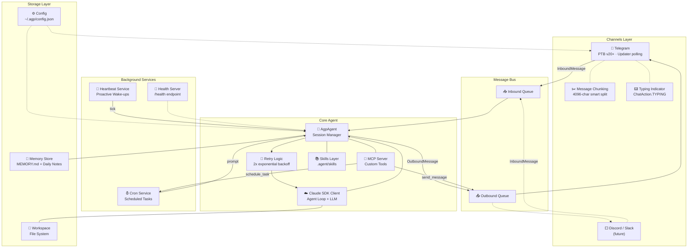
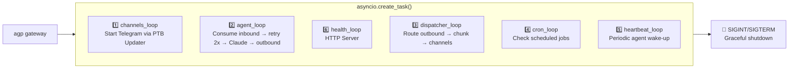
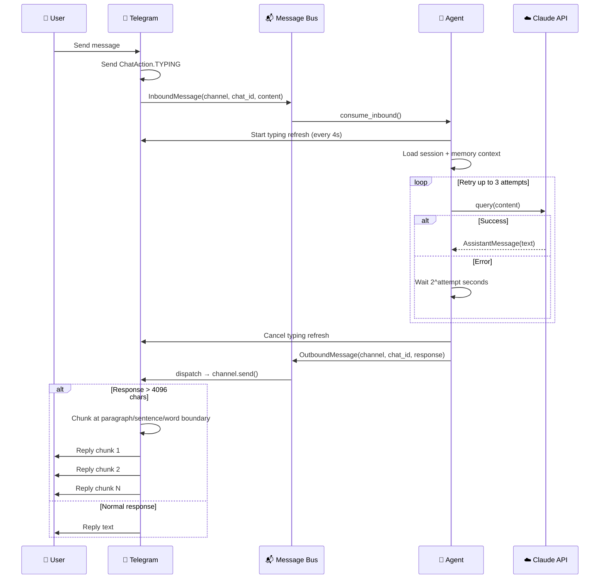

# AGP — Architecture

## System Overview



## Gateway Runtime



## Message Flow



## Project Structure

```
src/agp/
├── agent.py            # ClaudeSDKClient wrapper, session mgmt, MCP tools
├── channels/
│   ├── base.py         # BaseChannel ABC
│   ├── telegram.py     # Telegram integration (PTB v20+)
│   └── manager.py      # Channel lifecycle + outbound dispatch
├── bus/
│   ├── events.py       # InboundMessage / OutboundMessage dataclasses
│   └── queue.py        # Async queue-based message bus
├── config/
│   └── schema.py       # Pydantic v2 config schema
├── cron/
│   └── service.py      # Scheduled task runner
├── health/
│   └── service.py      # HTTP health endpoint
├── heartbeat/
│   └── service.py      # Proactive agent wake-ups
├── memory/
│   └── store.py        # File-based memory (MEMORY.md + daily notes)
└── cli/
    └── commands.py     # Typer CLI (agent, gateway, status, heartbeat)
```
