# AGP — Architecture

## System Overview

```mermaid
graph TB
    subgraph Channels["Channels Layer"]
        TG["🔵 Telegram<br/>PTB v20+ · Updater polling"]
        CHUNK["✂️ Message Chunking<br/>4096-char smart split"]
        TYPING["⌨️ Typing Indicator<br/>ChatAction.TYPING"]
        FUTURE["⬜ Discord / Slack<br/>(future)"]
    end

    subgraph Bus["Message Bus"]
        IQ["📥 Inbound Queue"]
        OQ["📤 Outbound Queue"]
    end

    subgraph Core["Core Agent"]
        AGENT["🤖 AgpAgent<br/>Session Manager"]
        RETRY["🔄 Retry Logic<br/>2x exponential backoff"]
        SDK["☁️ Claude SDK Client<br/>Agent Loop + LLM"]
        MCP["🔧 MCP Server<br/>Custom Tools"]
        SKILLS["📚 Skills Layer<br/>.agent/skills"]
    end

    subgraph Services["Background Services"]
        CRON["⏰ Cron Service<br/>Scheduled Tasks"]
        HB["💓 Heartbeat Service<br/>Proactive Wake-ups"]
        HEALTH["🏥 Health Server<br/>/health endpoint"]
    end

    subgraph Storage["Storage Layer"]
        MEM["📝 Memory Store<br/>MEMORY.md + Daily Notes"]
        WS["📂 Workspace<br/>File System"]
        CFG["⚙️ Config<br/>~/.agp/config.json"]
    end

    TG -- "InboundMessage" --> IQ
    TG -.- TYPING
    TG -.- CHUNK
    FUTURE -. "InboundMessage" .-> IQ
    IQ --> AGENT
    AGENT --> RETRY
    RETRY --> SDK
    SDK --> AGENT
    AGENT -- "OutboundMessage" --> OQ
    OQ --> TG
    OQ -.-> FUTURE

    AGENT --- MCP
    AGENT --- SKILLS
    MCP -- "send_message" --> OQ
    MCP -- "schedule_task" --> CRON

    CRON -- "prompt" --> AGENT
    HB -- "tick" --> AGENT
    HEALTH -.-> AGENT

    AGENT --- MEM
    SDK --- WS
    CFG -.-> AGENT
    CFG -.-> TG
```



## Gateway Runtime

```mermaid
graph LR
    subgraph Tasks["asyncio.create_task()"]
        T1["1️⃣ channels_loop<br/>Start Telegram via PTB Updater"]
        T2["2️⃣ agent_loop<br/>Consume inbound → retry 2x → Claude → outbound"]
        T6["  ↳ _send_typing<br/>Refresh typing every 4s"]
        T3["3️⃣ dispatcher_loop<br/>Route outbound → chunk → channels"]
        T4["4️⃣ cron_loop<br/>Check scheduled jobs"]
        T5["5️⃣ heartbeat_loop<br/>Periodic agent wake-up"]
        T6["6️⃣ health_loop<br/>HTTP Server"]
    end

    CMD["agp gateway"] --> Tasks
    Tasks --> SHUT["🛑 SIGINT/SIGTERM<br/>Graceful shutdown"]
```



## Message Flow

```mermaid
sequenceDiagram
    participant U as 👤 User
    participant TG as 🔵 Telegram
    participant BUS as 📬 Message Bus
    participant AGT as 🤖 Agent
    participant LLM as ☁️ Claude API

    U->>TG: Send message
    TG->>TG: Send ChatAction.TYPING
    TG->>BUS: InboundMessage(channel, chat_id, content)
    BUS->>AGT: consume_inbound()
    AGT->>TG: Start typing refresh (every 4s)
    AGT->>AGT: Load session + memory context

    loop Retry up to 3 attempts
        AGT->>LLM: query(content)
        alt Success
            LLM-->>AGT: AssistantMessage(text)
        else Error
            AGT->>AGT: Wait 2^attempt seconds
        end
    end

    AGT->>TG: Cancel typing refresh
    AGT->>BUS: OutboundMessage(channel, chat_id, response)
    BUS->>TG: dispatch → channel.send()

    alt Response > 4096 chars
        TG->>TG: Chunk at paragraph/sentence/word boundary
        TG->>U: Reply chunk 1
        TG->>U: Reply chunk 2
        TG->>U: Reply chunk N
    else Normal response
        TG->>U: Reply text
    end
```



## Project Structure

```
src/agp/
├── agent.py            # ClaudeSDKClient wrapper, session mgmt, MCP tools
├── channels/
│   ├── base.py         # BaseChannel ABC
│   ├── telegram.py     # Telegram integration (PTB v20+)
│   └── manager.py      # Channel lifecycle + outbound dispatch
├── bus/
│   ├── events.py       # InboundMessage / OutboundMessage dataclasses
│   └── queue.py        # Async queue-based message bus
├── config/
│   └── schema.py       # Pydantic v2 config schema
├── cron/
│   └── service.py      # Scheduled task runner
├── health/
│   └── service.py      # HTTP health endpoint
├── heartbeat/
│   └── service.py      # Proactive agent wake-ups
├── memory/
│   └── store.py        # File-based memory (MEMORY.md + daily notes)
└── cli/
    └── commands.py     # Typer CLI (agent, gateway, status, heartbeat)
```
