# AGP — Agentic Gateway Protocol

> **Your personal AI assistant, evolved.**
> powered by [Claude Agent SDK](https://github.com/anthropics/claude-agent-sdk)

## What is AGP?
AGP is a lightweight, extensible gateway that connects **Anthropic's Claude** to your digital life. 

Unlike typical chat bots that are trapped in a browser tab, AGP runs as a **persistent background service** on your machine. It has:
- **Long-term Memory**: Remembers facts about you and your projects.
- **Skills**: Can learn new tools on the fly (like searching docs or managing servers).
- **Agency**: Can schedule its own tasks ("Remind me to check the logs every morning").
- **Multi-Channel**: Talk to it via Telegram, CLI, or (in the future) Discord/Slack.

## Why we built it
We wanted a personal assistant that was **truly agentic** but **technically simple**.

Previous versions of Nanobot were complex 2,000-line monoliths handling their own agent loops, tool execution, and LLM provider logic. This was brittle and hard to maintain.

**The Solution**: We rebuilt everything on top of the **Claude Agent SDK**. 
- The SDK handles the "brain" (agent loop, tool calling, error recovery).
- AGP handles the "body" (persistence, communication channels, job scheduling).

### 🛡️ Security & Access Control
By default, AGP only responds to users listed in the `allow_from` list in your `config.json`.

**How to find your Telegram User ID:**
1.  Message [@userinfobot](https://t.me/userinfobot) or [@MissRose_bot](https://t.me/MissRose_bot) on Telegram.
2.  Type `/id`.
3.  Add the resulting number to your `allow_from` list:
    ```json
    "telegram": {
      "enabled": true,
      "token": "YOUR_BOT_TOKEN",
      "allow_from": ["12345678"]
    }
    ```

---

## Architecture

AGP implements the **Gateway Pattern**:

```mermaid
graph TD
    User((👤 You)) <--> Telegram[🔵 Telegram Channel]
    Telegram <--> Gateway[🏰 AGP Gateway]
    
    subgraph Gateway
        Bus[📬 Message Bus]
        Cron[⏰ Scheduler]
        Memory[🧠 File Memory]
        Skills[📚 Skills Loader]
        
        Agent[🤖 AgpAgent]
    end
    
    Agent <--> SDK[☁️ Claude Agent SDK]
    SDK <--> Anthropic[🟣 Anthropic API]
```



1.  **AgpAgent**: A thin wrapper around `ClaudeSDKClient`. It injects your memory and skills into every request.
2.  **Message Bus**: Decouples chat platforms (Telegram) from the agent. Handles rate limiting, queueing, and typing indicators.
3.  **Persistence**: Sessions, memory, and scheduled jobs are all stored as simple files in your `~/.agp/workspace`.
4.  **Resilience**: Auto-reconnection, exponential backoff, and a health endpoint keep it running 24/7.

## Key Features

### 🧠 Memory System
AGP has a file-based memory that you can edit directly.
- **Long-term**: `workspace/memory/MEMORY.md` — Permanent facts.
- **Daily Notes**: `workspace/memory/YYYY-MM-DD.md` — Ephemeral daily context.
*The agent reads these before every reply and updates them automatically.*

### 📚 Skills System
Skills are external toolsets that the agent can "learn" dynamically. AGP automatically loads skills from your project configuration.

- **How it works**:
    1. A skill is a directory with a `SKILL.md` file (instructions + tool definitions).
    2. We symlink your `.agent/skills` folder to `.claude/skills`.
    3. The agent has a `Skill` tool that lets it read these definitions on demand.
    4. When you say "Use context7...", the agent reads `SKILL.md` to understand how to call that API.

- **Example**: `context7`
    - A skill that lets the agent search for libraries and fetch their docs.
    - It's not hardcoded in Python; it's defined entirely in markdown!

### 🔧 MCP (Model Context Protocol)
AGP is built on the **Model Context Protocol**, an open standard for connecting AI to systems.

1.  **Internal MCP Server**:
    - AGP runs its own MCP server for core tools: `send_message` (Telegram) and `schedule_task` (Cron).
    - This allows the "brain" (Claude SDK) to control the "body" (Gateway).

2.  **External MCP Servers**:
    - You can connect AGP to *any* MCP server (e.g., Filesystem, GitHub, Postgres,etc) via `config.json`.
    - This gives the agent safe access to your local files or remote data.
3.  **Automatic Discovery**:
    - AGP automatically loads any MCP servers you've configured in the **Claude Code CLI** (`~/.claude/config.json`).
    - If you've already set up servers for Claude, they will just work here too!

### ⏰ Cron Tasks
You can schedule tasks via chat:
> *"Check the weather every morning at 8am."*

Or by editing `workspace/cron_jobs.json`. The agent uses the `schedule_task` tool to manage its own schedule.

## 🚀 Getting Started

### 1. Clone & Prepare
```bash
git clone https://github.com/your-username/agp.git
cd agp

# Create and activate a virtual environment
python3 -m venv venv
source venv/bin/activate
```

### 2. Automatic Setup
Run the setup script to install dependencies, create the `~/.agp` config directory, and initialize your workspace templates (`USER.md`, `SOUL.md`, etc.).
```bash
chmod +x setup.sh
./setup.sh
```

### 3. API Configuration
AGP needs an API key.
- **Option A (Environment Variable)**:
  ```bash
  export ANTHROPIC_API_KEY='sk-ant-...'
  ```
- **Option B (Custom Provider)**: Edit `~/.agp/config.json` (see below).

## Configuration

Config file: `~/.agp/config.json`

```json
{
  "workspace": "~/.agp/workspace",
  "model": "sonnet",
  "env": {
    "CLAUDE_CODE_EXPERIMENTAL_AGENT_TEAMS": "1"
  },
  "provider": {
    "base_url": "https://api.z.ai/api/anthropic",
    "auth_token": "sk-...",
    "model_override": "GLM-4.7"
  },
  "mcp_servers": {
    "filesystem": {
      "type": "stdio",
      "command": "npx",
      "args": [
        "-y",
        "@modelcontextprotocol/server-filesystem",
        "/home/user"
      ]
    }
  },
  "channels": {
    "telegram": {
      "enabled": true,
      "token": "your_telegram_bot_token",
      "allowFrom": [
        "your_telegram_user_id"
      ]
    }
  }
}
```

## Usage

```bash
# Start the Gateway (Daemon)
agp gateway

# Interactive CLI Chat
agp agent

# Quick One-shot
agp agent -m "Add 'buy milk' to my daily notes"

# Check System Health
agp status
```

## 🏰 Gateway Management

For long-running operation, use the provided management script:

```bash
./manage.sh start     # Start gateway in background
./manage.sh stop      # Stop the background gateway
./manage.sh restart   # Restart the gateway
./manage.sh status    # Check status and current config
./manage.sh logs      # Tail the gateway logs
```

Logs are stored in `~/.agp/gateway.log` for troubleshooting.

---
 